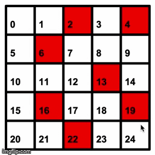

Play with the Q-learning algorithm with our Python Turtle GUI! 

Click on a square to create a block; the agent's reward changes to negative.

The Q-learning agent starts at a random point in the maze, and makes random actions until it reaches the destination.

It records the action and reward in a Q matrix, where it stores all its experience and can use that data to make smarter decisions in the future.

The Q matrix is made of a Feasibility and Reward Matrix; F[a,b] = 1 means that the agent can move from state a to state b. R[a,b] = 10 means the agent receives a reward of +10 when it goes from state a to state b. 

Note that the algorithm takes a while to run, on the order of minutes.

Adjust max_epoch if the agent ends up in an infinite loop.